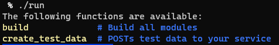
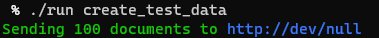
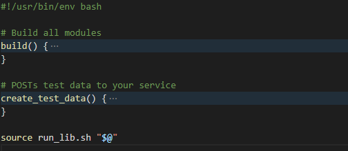

# run_lib


## Overview
This is bash script that helps you organise and allow discovery of your project's scripts: 



It lets you run them quickly:



All you need to do is source `run_lib.sh` in your file full of functions, like this:



It also as a `README.md` that's longer than the actual code! I'm sure there's a badge for that.


## Installation
`run_lib.sh` is just a bash script so there are many ways to skin this cat. Here's what I recommend. Note this assumes you store things you run in `~/bin/`. If you don't want it there then change the code in this section.

Get the repo:
```bash
git clone https://github.com/jamescoleuk/run_lib.git ~/bin/run_lib
```

Copy it to whatever project you're working on. Maybe create an alias for that? you'll want to do something like this:
```bash
run_lib() {
  cp --interactive ~/bin/run_lib/run_lib.sh .
  cp --interactive ~/bin/run_lib/run .
}
```

You could just `wget` the files from GitHub and avoid having to clone the repo. But then I, or some other malicious actor, could change the file and when run it might do damage. So don't do that.


## Configuration
Configuration means adding your functions to `~./run`, like this:
```bash
# Let the world know the truth
linux_is_better_than_osx (){
  echo -e "Linux for ever"
}
```

Notice the single-line comment, to be used when you execute `./run` without any arguments.

Make sure sourcing `run_lib.sh` is the last thing you do.


## Waffle (rationale)

In just the last year I've worked on projects that require commands to be run using Gradle, NPM, Yarn, straight bash scripts, random Python and pip, Terraform, Docker and docker-compose, aws, Svelte, and Rust. How exciting, but also what a lot of context switching. I end up forgetting things. Like how do I build and deploy this Java project again? How do I run the Svelte dev server? What's the gradle command to build jOOQ POJOs for a particular sub-module? So boring. I want to write these things down, as succinctly as possible, and be able to glance at a file or script output and see what's available to me for this particular project. 

### What about `make`?

`make` offers a ubuiquitous and simple way to create this kind of project menu for developers. You can add targets to print out help, or use something like [modern make](https://github.com/tj/mmake).

What're the down-sides to using `make` in this way?

* It has several aspects that make it harder to work with: tabs vs spaces, each line executing as a new shall. Good luck trying to anything complicated and multi-line, e.g. sourcing something useful.

* It has no built-in support for help and I really value a menu with descriptions. It makes the file more discoverable, for other people and for myself a few months later. You can use some arcane boiler plate to get help lines in a makefile. But the default action for `make` is to compile code and its a bit hacky to hijack it like this. But there are [lots of options](https://gist.github.com/prwhite/8168133) if you're interested in doing that.

* Make is designed for _making_ files, with dependencies, and not just for running random commands. This creates a cognitive barrier for those who just want to run stuff, and it irritates the hell out of those who do actually use make for building stuff. And the work-around, adding `.PHONY:` everywhere is straight-up horrid.

### What are the other options?
What about `npm` and adding to `scripts` in `packages.json`? Only if you want data scientists and back-end developers to hate you. And why not just use scripts?

* These will breed like rabbits. 

* They're not discoverable without reading files.

### Why `run_lib`?
* It's simple, unambiguous, easy to read and use and crucially, it's probably good enough. 

* It's written in bash, which is ideal if you want to write bash to do stuff.

* It does away with the problems of using Makefiles for this purpose, and replaces it with as yet unknown problems! If you see any PR me or mail me and we'll see what can be done.


## Questions

### Why source `./run_lib.sh` instead of just executing it?
Sourcing means everything in `run_lib.sh` is introduced as part of your current shell, and not in a new one. If you executed it, i.e. `./run_lib.sh "$@"` instead of `source ./run_lib.sh "@$"`, then it'd be a new shell and none of the colours would work and the code that looks for functions would be looking at `./run_lib.sh` instead of `./run`. 

### What's with `./run` not having an `sh` extension? And why is `./run_lib.sh` not executable?
May I refer you to [Google's style guide](https://google.github.io/styleguide/shellguide.html#s2.1-file-extensions)?
